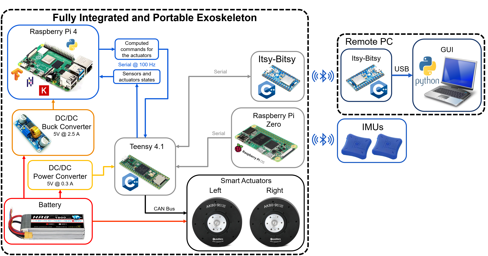
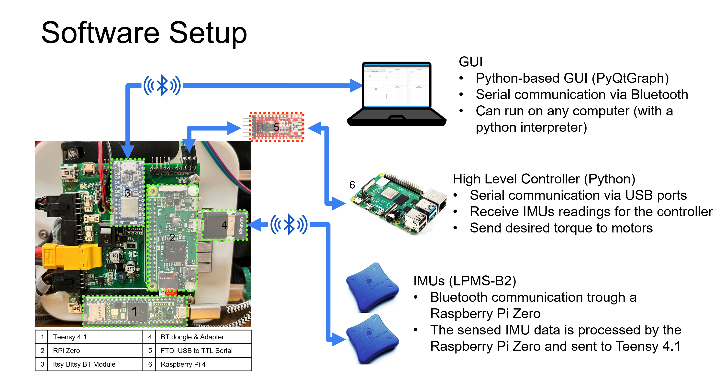
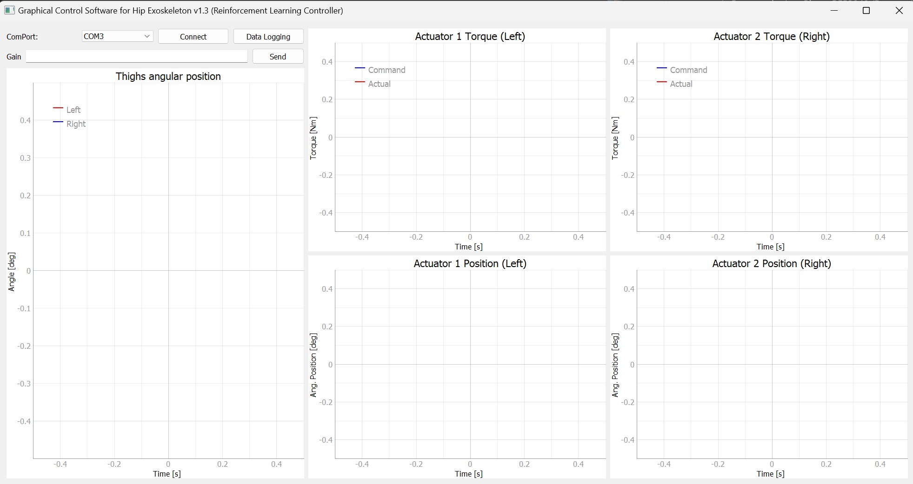
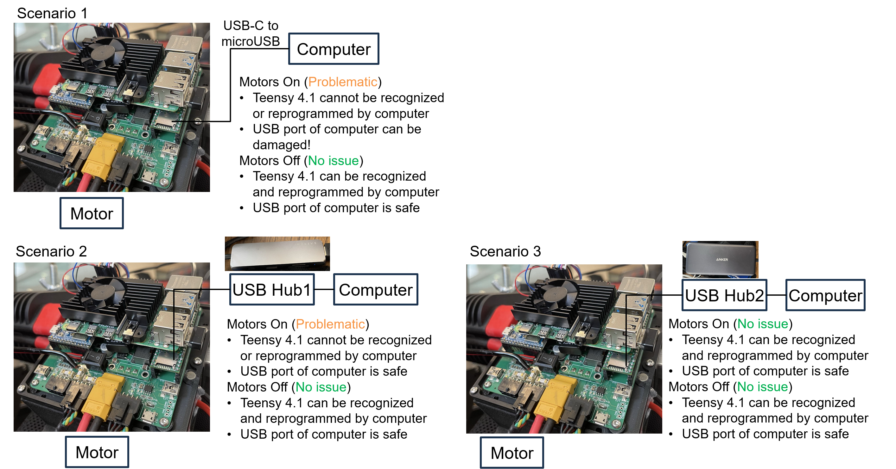
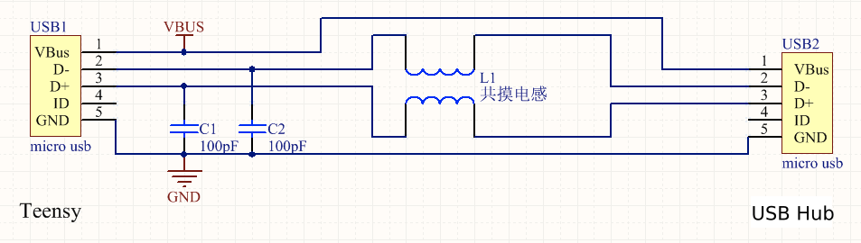

# Hip_exoskeleton_v1.4_control_software

## Python version

## Matlab version

# How to setup the software

## Prerequisites

### 1. Teensy 4.1

1. Install the proper version of Arduino IDE from https://www.arduino.cc/en/software
2. Follow the instructions from https://www.pjrc.com/teensy/td_download.html
3. In the "LIBRARY MANAGER" section, search for "MovingAverager" by Ian Carey and install it.

### 2. Remote PC

1. Install the proper distribution of anaconda from https://www.anaconda.com/download/success
2. In anaconda, create a virtual environment and install the following libraries:
    1. pyqtgraph
    2. pyqt5
    3. pyserial
    4. pyqt-tools
    5. qt5-applications
    6. qt5-tools

3. Install the proper distribution of Visual Studio Code from https://code.visualstudio.com/download
4. Download all the required files (from this GitHub repository):
    1. High-level controller (Reinforcement Learning-based Controller)
    2. Arduino code (for Teensy 4.1)
    3. Raspberry Pi Zero OS image
    4. Exoskeleton Bluetooth module (Itsy-Bitsy)
    5. Remote PC Bluetooth module (Itsy-Bitsy)
    6. Control Software & Graphical User Interface

# About

This repository contains all the files related to the development of the GUI for the Hip Exoskeleton GUI.

Each of the files correspond to a different version of the GUI and track the development proccess of it.

For convinience, at the beggining of each of the files, a general description of the code and the changes made is given.

### The GUI operates along other pices of code stored and running in different elements of hardware. Without these other elements (hardware and software) the GUI cannot work properly.

## Brief overview of the whole system (software & hardware interactions)

There are different software elements running into different devices:

- Software
    1. High-level Controller [Python]
    2. Data handling (Receive & Transmit) and drive the motors [C++/Arduino]
    3. IMU data adquisition [Raspberry Pi OS]
    4. Data transmit & recieve (Exoskeleton) [C++/Arduino]
    5. Data transmit & recieve (Remote PC) [C++/Arduino]
    6. GUI [Python]

- Hardware
    1. PC
    2. Teensy 4.1
    3. Raspberry Pi Zero W
    4. Itsy-Bitsy nRF52840 (Exoskeleton)
    5. Itsy-Bitsy nRF52840 (Remote PC)
    6. PC

# Requiremets for running the GUI

1. The code running in Teensy 4.1 must contain a proper function to gather, encode and send that data through serial protocol to the Bluetooth module on the exoskeleton.
2. The Bluetooth module on the exoskeleton must have uploaded the corresponding code as well as the Bluetooth device on the Remote PC.

# Running the GUI

###  To run the code you need to install the following libraries:

 - PyQtGraph library: https://www.pyqtgraph.org/
 - Serial

### Running the GUI is very easy, just need to execute the code (Python interpreter needed).

1. Connect the Itsy-Bitsy nRF52840 (Remote PC) Bluetooth device to the Remote PC using the proper cable.
2. Execute the code (using the Python interpreter).
3. Select the COM port where the Bluetooth module is connected.
4. Click the "Connect Bluetooth" button.

The most recent version of the GUI is "HipExo_GUI_v11.py".

### The following window shows how the most recent version of the GUI looks like.

Youtube video: https://youtu.be/w6m0pwIsVQM

### The GUI has the following features:

- Display in real-time up to 6 different signals
    - Left IMU pitch angle
    - Right IMU pitch angle
    - Left motor's desired and actual torque
    - Right motor's desired and actual torque

- Log data (csv file)
- Detect the available COM ports
- Select the COM port for the communication

# Common Issues

## Teensy 4.1 in the control box cannot be recognized by high-level computer when motors are turned on

### **Description**

It is observed that Teensy 4.1 in the control box cannot be recognized by the high-level computer when motors are turned on. 

* **Scenario 1**: If Teensy 4.1 is directly connected to the USB port of the computer via microUSB-to-USB cable, the USB port of the computer can be damaged. Teensy 4.1 also cannot be reprogrammed in this case.  
* **Scenario 2**: If Teensy 4.1 is connected to the computer via a low-end USB hub (e.g., [Satechi USB-C Hub](https://www.amazon.com/Satechi-USB-C-Multi-Port-Ethernet-Adapter/dp/B083XCLQWP))
* **Scenario 3**: If Teensy 4.1 is connected to the computer via a high-end USB hub (e.g., [Anker USB-C Hub](https://www.amazon.com/Anker-PowerExpand-Adapter-Delivery-Ethernet/dp/B0874M3KW4) we used), everything is fine. Teensy 4.1 can be recognized and reprogrammed by the computer without issues regardless of whether motors are turned on or not.

### **Investigation**

* **Scenario 2**: 
  * Case 1 (with intact microUSB-to-USB cable and motor turned on): Voltage on D+ wire within the microUSB-to-USB cable rises to 2.7V.
  * Case 2 (with 5V line within microUSB-to-USB cable cut and motor turned off): No voltage on D+ or D- wire; 5V on both ends of the cut 5V wire.
  * Case 3 (with 5V line within microUSB-to-USB cable cut and motor turned on): No voltage on D- wire; ~3V on D+ wire; 5V on both ends of the cut 5V wire.
* **Scenario 3**: 
  * Case 1 (with intact microUSB-to-USB cable and motor turned on): Voltage on D+ wire within the microUSB-to-USB cable rises to 0.7V when motor is turned on.
  * Case 2 (with 5V line within microUSB-to-USB cable cut and motor turned off): No voltage on D+ or D- wire; 5V on the end of the cut 5V wire proximal to Teensy and zero voltage on the other end of the cut 5V wire proximal to the computer.
  * Case 3 (with 5V line within microUSB-to-USB cable cut and motor turned on): No voltage on D- wire; ~1.5V on D+ wire; 5V on the end of the cut 5V wire proximal to Teensy and zero voltage on the other end of the cut 5V wire proximal to the computer.

### **Cause**

Teensy does not have a built-in signal filtering circuit. As a result, the voltage on D+ line of the microUSB cable rises to a voltage that is too high when motor is turned on, which could damage the USB port of the computer. A good USB hub that has built-in signal filtering circuit can suppress the high voltage on D+ wire and maintain functional communication.

### **Solution**
* Temporary solution 1: Use a USB hub (e.g., [this one](https://www.amazon.com/Anker-PowerExpand-Adapter-Delivery-Ethernet/dp/B0874M3KW4)) that has built-in signal filtering circuit can suppress the high voltage on D+ wire and maintain functional communication.
* Temporary solution 2: Connect capacitors and inductors (uH level) to the microUSB-to-USB cable as shown below.
  
* Temporary solution 3: Connect to Teensy and reprogram Teensy only when motors are turned off.
* Permanent solution: to be added.

